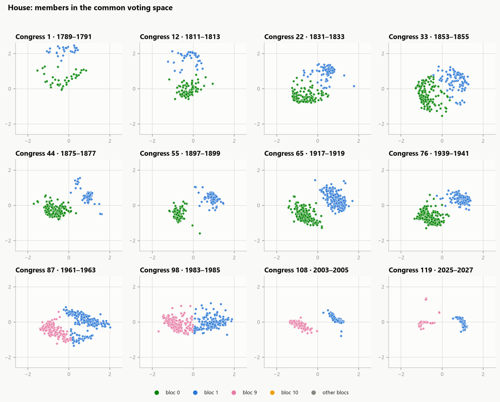
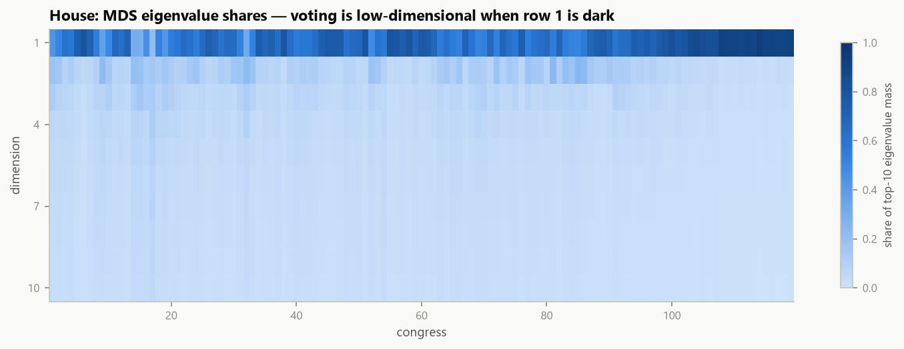
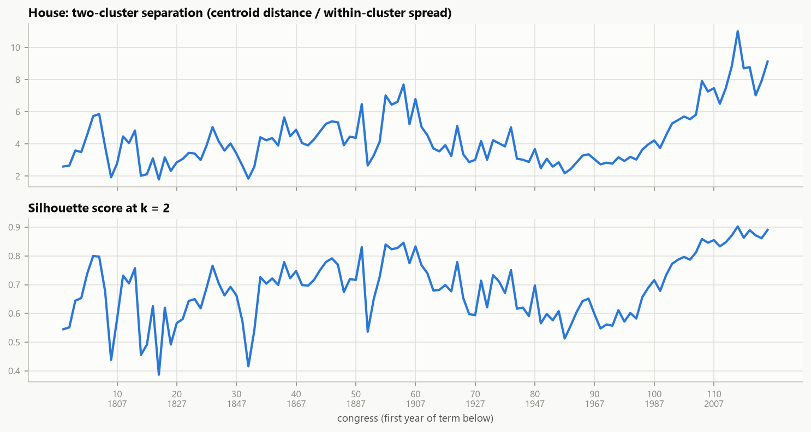
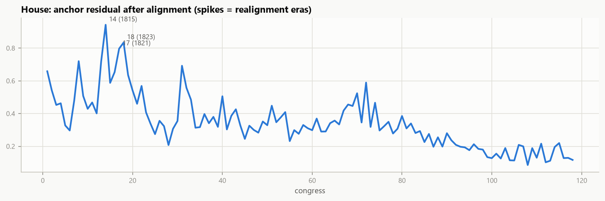
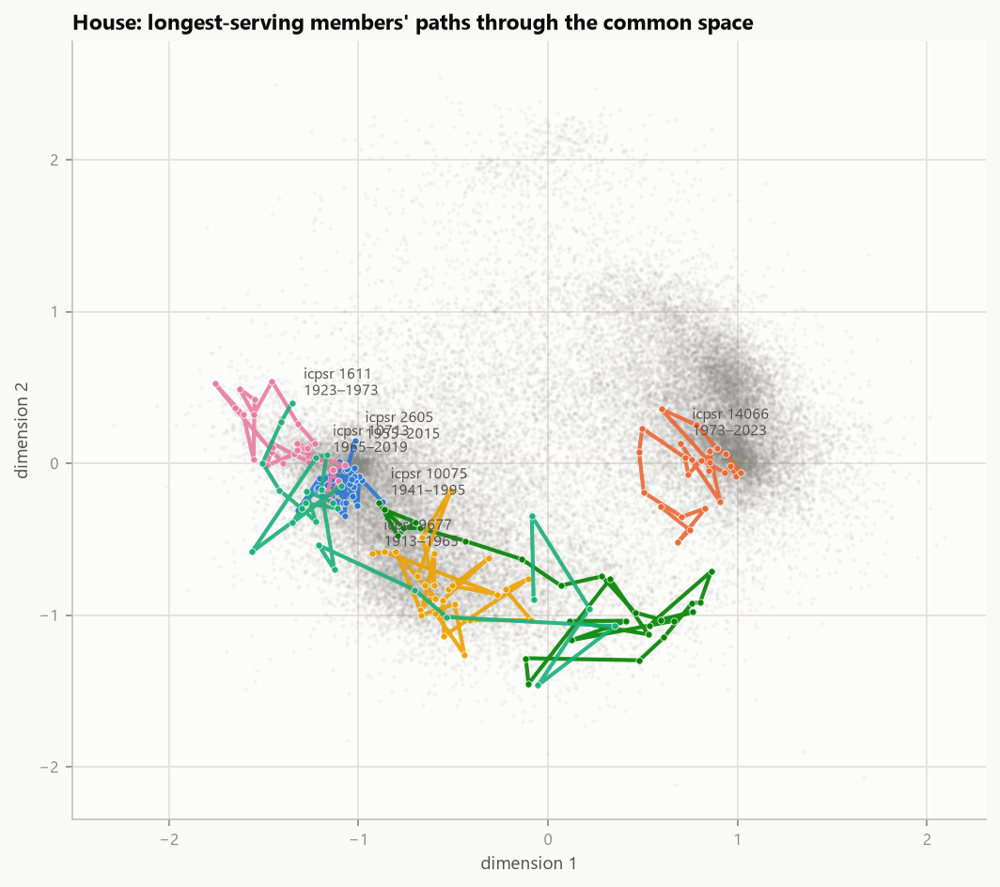

# A Common Voting Space for Two Centuries of Congress: Anchor-Based Alignment of Per-Congress Roll-Call Scalings

*Draft manuscript — [Author], July 2026*

## Abstract

Spatial analysis of roll-call voting is a standard tool for describing legislative behavior, but coordinates estimated from different congresses are not directly comparable: each congress votes on a different agenda, and any scaling of a single congress is identified only up to rotation, reflection, and scale. We present a deliberately minimal, fully label-free pipeline that places all 119 U.S. Congresses (1789–2027) in a single two-dimensional space using nothing but the votes themselves. Each congress is scaled independently by classical multidimensional scaling of pairwise agreement distances; the resulting maps are then stitched into one frame by chained orthogonal Procrustes fits on members who serve in multiple congresses, followed by a generalized Procrustes refinement that removes accumulated chain drift. Cluster labels are made continuous over time by assignment matching on shared members, yielding persistent voting blocs discovered without party labels. The machinery is validated three ways: it recovers known positions from synthetic vote data at r = 0.99; independent halves of the real roll-call record reproduce each other at mean r = 0.96; and, using no metadata, the output reproduces canonical findings of the congressional-scaling literature — the rise, mid-twentieth-century trough, and unprecedented modern peak of polarization; the near-collapse of voting to a single dimension after 1980; and bloc-lineage births and breaks that coincide with the formation of the mass party system, Reconstruction, and the New Deal.

## 1. Introduction

The United States Congress has recorded roll-call votes continuously since 1789, and the resulting record is among the most intensively analyzed datasets in political science. The dominant analytical tradition represents legislators as points in a low-dimensional "ideological" space estimated from their votes, beginning with the NOMINATE family of models (Poole and Rosenthal 1985, 1997) and continuing through Bayesian item-response formulations (Clinton, Jackman, and Rivers 2004; Martin and Quinn 2002). A robust and repeatedly confirmed finding of this literature is that congressional voting is low-dimensional: one dimension, usually glossed as left–right economic conflict, organizes the large majority of votes in most periods, with a second dimension appearing episodically (Poole 2005).

Comparing such spaces *across* congresses, however, is not automatic. Two obstacles compound. First, the agenda changes: the 1st Congress and the 119th share no roll calls, so their vote matrices have no columns in common and cannot be scaled jointly by naive methods. Second, any scaling of a single congress is identified only up to similarity transformations — rotation, reflection, translation, and scale — so even two adjacent congresses scaled separately emerge in arbitrary, mutually incompatible orientations. Existing solutions estimate a joint parametric model in which legislators serving in multiple congresses tie the periods together, either with constrained smooth movement (DW-NOMINATE; Poole and Rosenthal 1997), with fixed positions ("common space" scores; Poole 1998), or with explicit dynamic priors (Martin and Quinn 2002); related bridging strategies extend the idea across institutions (Bailey 2007).

This paper develops and validates the simplest version of the bridging idea we could construct, as a modular pipeline whose every stage is separately checkable. Each congress is scaled *independently* by a non-parametric method — classical multidimensional scaling of pairwise agreement distances — and the per-congress maps are then aligned *afterward*, using members who appear in multiple congresses as anchors for chained orthogonal Procrustes fits, followed by a generalized Procrustes refinement that uses every multi-congress career simultaneously. Finally, per-congress cluster labels are chained into persistent bloc lineages by assignment matching on shared members.

Three properties distinguish the approach. It is *label-free*: no member names, party affiliations, or bill topics enter at any stage, so recovering known political history becomes an out-of-sample check rather than a circularity. It is *modular*: scaling, alignment, and clustering are independent stages with inspectable intermediate output, and each is validated separately as well as end-to-end. And it is *cheap*: the full pipeline runs in under a minute per chamber on a laptop, making sensitivity analysis trivial.

Our contribution is accordingly twofold. Methodologically, we show that per-congress non-parametric scaling plus anchor-based Procrustes alignment — a combination of tools from psychometrics (Torgerson 1952; Schönemann 1966; Gower 1975) — suffices to build a coherent two-century common space, and we quantify its reliability with a synthetic-recovery experiment and a split-half design. Substantively, we show that this minimal machinery reproduces, without any metadata, the canonical macro-findings of the roll-call literature: the polarization trajectory documented by McCarty, Poole, and Rosenthal (2006), the modern collapse of voting onto a single dimension, and party-system transitions that appear in our output as births and breaks of unlabeled bloc lineages at historically correct dates.

## 2. Data

We use the Voteview member-vote file `HSall_votes.csv` (Lewis et al. 2025), covering every recorded roll call in both chambers from the 1st through the 119th Congress (1789–2027): 26.4 million member-vote records. Each record carries the congress number, chamber, roll-call number, a member identifier (`icpsr`), and a cast code. We map Yea codes (1–3) to +1 and Nay codes (4–6) to −1; Present, Not Voting, and non-membership codes become missing. The file's `prob` field is an output of Voteview's own NOMINATE estimation and is never read, to avoid circularity.

The `icpsr` identifier is stable across a member's career, which is what makes anchoring possible. Overlap between adjacent congresses is large in every era: the 118th and 119th Houses share 375 of roughly 450 members, and even across the 40th–41st Congresses (1867–1871) the House shares 121 members and the Senate 52 — the Senate's staggered six-year terms guarantee roughly two-thirds continuity by construction. One Voteview convention matters for us: a member who switches parties receives a *new* identifier. Such members simply drop out of the anchor pool at the switch, which is benign and arguably helpful, since they are precisely the members most likely to violate the anchoring assumption introduced below.

Following standard practice, we drop near-unanimous roll calls (minority side below 2.5% of casts), which carry almost no discriminative information, and then members with fewer than 20 cast votes in a congress. Because the two chambers never vote on the same roll calls within a congress, a merged matrix would be block-diagonal with no connecting columns; we therefore build one common space per chamber. Table 1 summarizes the corpus after filtering.

**Table 1.** Corpus and pipeline summary by chamber, congresses 1–119.

| | House | Senate |
|---|---|---|
| Congresses scaled | 119 | 119 |
| Roll calls kept after filtering | 52,244 | 49,356 |
| Member-congress observations | 40,299 | 9,726 |
| Unique members | 11,207 | 1,975 |
| Mean members per congress | 339 | 82 |
| Anchor pool, minimum / median | 46 / 280 | 17 / 74 |
| Procrustes-refinement iterations to convergence | 2,915 | 2,658 |

## 3. Methods

### 3.1 Per-congress scaling

For each (chamber, congress) we form the member × roll-call matrix **V** with entries +1, −1, or missing. The pairwise **agreement distance** between members *i* and *j* is

> d(i, j) = 1 − (number of jointly cast roll calls on which i and j vote identically) / (number of jointly cast roll calls).

Restricting each pair's comparison to jointly cast votes handles missingness without imputation: a member's absences shrink the denominator rather than being coerced to a neutral value, avoiding the origin-ward bias that zero-filling induces in PCA-style approaches. Distances of this family have been used since the earliest quantitative studies of legislative voting (Rice 1928) and underlie non-parametric scaling methods such as optimal classification (Poole 2000). The rare pair with *no* jointly cast roll calls — typically a member who died in office and their replacement — receives the mean of its rows' defined distances. The full matrix is computed with two matrix products, and member × member matrices never exceed roughly 450 × 450.

Coordinates come from classical (Torgerson) multidimensional scaling (Torgerson 1952; Gower 1966): square the distances, double-center, and take the top-*k* eigenvectors scaled by the square roots of their eigenvalues. We retain *k* = 2 dimensions and record the leading ten eigenvalues of every congress as a dimensionality diagnostic. Agreement distances are not exactly Euclidean, so trailing eigenvalues can be mildly negative; they are simply unused. Each congress's coordinate cloud is then centered and rescaled to unit root-mean-square radius, because raw MDS scale reflects agenda composition and is not comparable across eras; era-to-era changes in polarization are instead read from internal cluster separation (Section 3.3), which the normalization preserves.

### 3.2 Alignment into a common frame

An MDS solution is identified only up to rotation and reflection, so per-congress maps emerge in arbitrary orientations — one congress's map may be mirror-imaged or turned relative to the next. We fix orientations with the members the congresses share.

Given anchor coordinates **A** (rows = shared members in the unaligned congress) and target coordinates **B** (the same members' positions in the already-aligned frame), the orthogonal Procrustes problem finds the rotation/reflection **R** minimizing ‖**A R** − **B**‖ in the least-squares sense; the solution is available in closed form from the singular value decomposition of **AᵀB** (Schönemann 1966). We fit **R** together with a translation (both sides centered on their anchor means) and apply the resulting transform to *every* member of the congress, anchors and freshmen alike.

Alignment proceeds backward from the most recent congress, which defines the reference frame: the 118th is aligned to the 119th, the 117th to the result, and so on to 1789. A member's target is their position in the *nearest later* congress in which they appear, so the effective anchor pool for congress *t* is the union of all members who serve in any later congress — members returning after a gap still contribute. Anchor pools are never thin (Table 1). The identifying assumption is that returning members mostly keep voting like themselves; because **R** is a least-squares compromise over tens to hundreds of anchors, individual movers are outvoted. The mean anchor-to-target distance remaining after each fit is logged as the **anchor residual**, a direct measure of how much returning members collectively moved between congresses — and, as Section 4.4 shows, an informative realignment detector in its own right.

A chain of 118 noisy fits accumulates drift: small errors compound, and distant congresses can end up slightly twisted relative to the reference frame. We therefore add a **generalized Procrustes** refinement (Gower 1975): compute each member's consensus position (the mean of their aligned positions across all congresses served), re-fit every congress against its members' consensus positions, recompute the consensus, and iterate to a fixed point. This couples every pair of congresses that share any member directly, not only through the chain. Convergence is diffusion-like along the 119-congress chain — the slow modes are global "unbendings" of the timeline — and requires roughly 2,900 iterations (seconds, once vectorized); stopping early is consequential, as positions at iteration 100 still differ by up to 0.23 RMS-units from their converged values. Because updates are rotations and translations only, each congress's internal shape is preserved exactly: refinement can re-orient a congress but cannot distort it. The converged solution is re-pinned to the reference congress's orientation, and residual sign indeterminacy is resolved by a deterministic reflection convention. We emphasize that the resulting axes carry no intrinsic semantic orientation; naming them requires metadata we deliberately exclude.

### 3.3 Clustering and bloc lineages

Within the common space we cluster each congress with *k*-means for *k* = 2…6, selecting *k* by silhouette score (Rousseeuw 1987) under a parsimony rule calibrated to small-chamber noise: solutions with *k* > 2 are eligible only if their smallest cluster holds at least 5% of members, and the smallest eligible *k* within 0.02 of the best silhouette wins. Without this rule, silhouette sweeps on ~80-member Senates spawn ephemeral splinter clusters (41 lineages instead of 23). We also always record the *k* = 2 solution and define a **separation index** — the distance between the two cluster centroids divided by the pooled within-cluster spread — as a polarization measure comparable across congresses because all clouds share unit RMS radius.

Cluster labels are then made continuous over time. Proceeding chronologically, clusters in congress *t* are matched to the bloc labels of congress *t* − 1 by maximum-weight assignment (Kuhn 1955) on the count of shared members; a cluster with no inherited match founds a new bloc. The output is a set of persistent **bloc lineages** — unlabeled party-system objects recovered purely from voting behavior.

### 3.4 Validation design

We validate three ways. (i) *Synthetic recovery*: we simulate ten congresses of 80 members with known two-dimensional ideal points drawn from two blobs, 25% turnover per congress, slow independent drift (s.d. 0.05 per step), and 300 roll calls per congress generated from random cutting planes through a logistic choice model (slope 4, 8% missingness); we then run the full pipeline and compare recovered to true positions after a single global similarity fit. (ii) *Split-half reliability*: within a congress, the even- and odd-indexed roll calls are disjoint instruments; scaling each half separately and mapping one onto the other with a similarity Procrustes fit measures how much of a member's position is signal. (iii) *Historical adequacy*: because no metadata enter the pipeline, agreement between the output and well-documented macro-history — polarization trajectories, party-system dates — constitutes a genuine external check.

## 4. Results

### 4.1 The machinery works: synthetic and split-half validation

On synthetic data the pipeline recovers the 800 true member-congress positions at r = 0.990 after one global similarity fit; *k* = 2 clustering of the final congress reproduces the true blob assignment exactly (adjusted Rand index 1.0; Hubert and Arabie 1985), and lineage matching tracks the two blobs across all ten congresses without a break, spawning exactly two blocs.

On the real record, split-half reliability is uniformly high (Table 2): mean r = 0.964 across six congresses spanning two centuries in both chambers, with a worst case of 0.899 in the small, sparsely voting Senate of 1827. Positions are thus overwhelmingly signal, even where the method has least data.

**Table 2.** Split-half reliability: correlation between member positions estimated from even- versus odd-indexed roll calls (number of common members in parentheses).

| Congress (first year) | House r | Senate r |
|---|---|---|
| 20 (1827) | 0.975 (217) | 0.899 (53) |
| 40 (1867) | 0.975 (231) | 0.953 (67) |
| 60 (1907) | 0.962 (387) | 0.904 (91) |
| 80 (1947) | 0.948 (447) | 0.981 (97) |
| 100 (1987) | 0.995 (440) | 0.987 (102) |
| 119 (2025) | 0.996 (447) | 0.998 (102) |

### 4.2 Two centuries in one frame

**Figure 1.** The House in the common voting space at twelve moments, 1789–2027, colored by bloc lineage (top four lineages by membership; all others gray). Structure crystallizes from the diffuse founding era into the persistent two-bloc pattern, with the modern panels showing extreme cluster compactness.

Figure 1 shows the House at twelve moments. The founding congresses are diffuse, with weak and shifting groupings; a two-camp structure consolidates through the Jacksonian era; and from the mid-nineteenth century onward the space is organized by two blocs whose separation waxes and wanes. The modern panels are visually striking: by the 2020s each bloc has contracted to a tight knot, with the space between them essentially empty.

**Table 3.** Era summary (means over congresses in each era). *Share dim 1* is the first eigenvalue's share of the positive top-ten eigenvalue mass; *separation* is the two-cluster separation index; *residual* is the post-alignment anchor residual.

| Era | Share dim 1 H / S | Silhouette (k=2) H / S | Separation H / S | Residual H / S |
|---|---|---|---|---|
| 1789–1825 | 0.53 / 0.48 | 0.62 / 0.57 | 3.5 / 3.1 | 0.57 / 0.68 |
| 1825–1861 | 0.61 / 0.54 | 0.63 / 0.62 | 3.5 / 3.4 | 0.42 / 0.46 |
| 1861–1901 | 0.67 / 0.58 | 0.73 / 0.67 | 4.7 / 3.9 | 0.35 / 0.42 |
| 1901–1933 | 0.64 / 0.57 | 0.72 / 0.65 | 4.5 / 3.6 | 0.37 / 0.41 |
| 1933–1981 | 0.64 / 0.57 | 0.61 / 0.55 | 3.2 / 2.7 | 0.28 / 0.34 |
| 1981–2027 | 0.85 / 0.82 | 0.80 / 0.77 | 6.5 / 5.7 | 0.15 / 0.21 |

**Figure 2.** Share of top-ten eigenvalue mass by dimension and congress (House). A dark first row means voting is nearly one-dimensional; the second dimension carries visible mass in the antebellum and mid-twentieth-century eras and almost none after 1980.

The eigenvalue spectra (Figure 2, Table 3) reproduce the dimensionality narrative of the literature without a vote-choice model. The first dimension's share of eigenvalue mass in the House climbs from 0.53 in the founding era to 0.85 after 1981 — reaching ~0.90 in the 2020s — while the mid-twentieth century (0.64) shows the era's well-documented live second dimension, the cross-cutting axis associated with the conservative coalition and civil rights. The Senate tracks the House throughout at slightly lower levels, as expected for the smaller, individualistic chamber.

### 4.3 The polarization trajectory

**Figure 3.** Two-cluster separation (top) and k = 2 silhouette (bottom) by congress, House. The Gilded-Age peak, mid-twentieth-century trough, and modern surge emerge with no party labels in the pipeline.

Figure 3 traces the separation index and silhouette across all 119 Houses. Three features match the polarization literature (McCarty, Poole, and Rosenthal 2006) closely. Separation rises to a first peak around the turn of the twentieth century (era mean 4.7); it sags through the mid-century decades of cross-party coalitions (era mean 3.2, with silhouettes bottoming near 0.51); and it then climbs steeply from the 1980s to values with no historical precedent — a maximum of 11.0 at the 114th Congress (2015–17), with silhouettes of 0.90, meaning the two clusters are about as well separated as *k*-means clusters can be. The single least-structured moment of the whole record is the 17th Congress (1821–23), at the height of the one-party Era of Good Feelings, where the silhouette falls to 0.39 — in *both* chambers independently, a reassuring cross-chamber agreement on a subtle historical fact.

### 4.4 Bloc lineages, births, and breaks

**Table 4.** Major bloc lineages (≥250 member-congress observations or ≥10 congresses). Lineage identities are inferred from dates only; no party labels enter the pipeline.

| Chamber | Bloc | Congresses | Years | Obs. | Historically coincides with |
|---|---|---|---|---|---|
| House | 1 | 1–119 | 1789–2027 | 19,208 | Jeffersonian → Jacksonian → Democratic line |
| House | 0 | 1–81 | 1789–1951 | 11,640 | Federalist → Whig → Republican opposition line |
| House | 9 | 81–119 | 1949–2027 | 8,738 | Post-1948 second-cluster successor |
| Senate | 0 | 1–43 | 1789–1875 | 1,052 | Jeffersonian → Democratic line |
| Senate | 1 | 1–15 | 1789–1819 | 271 | Federalist era |
| Senate | 4 | 15–33 | 1817–1855 | 527 | Adams / Whig opposition |
| Senate | 8 | 33–43 | 1853–1875 | 286 | Early Republican era |
| Senate | 11 | 43–119 | 1873–2027 | 3,780 | Post-Reconstruction Republican line |
| Senate | 10 | 43–74 | 1873–1937 | 1,428 | Post-Reconstruction Democratic line |
| Senate | 17 | 74–119 | 1935–2027 | 2,133 | New Deal Democratic line |

The lineage output (Table 4) is the pipeline's most historically legible product. In the House, one lineage runs unbroken through all 119 congresses — consistent with the conventional genealogy of the Democratic line — while the opposition lineage runs 1789–1951 and is succeeded by a new lineage founded in 1949, precisely the years of the Dixiecrat revolt and the mid-century scramble of the second cluster. Among the small ephemeral House blocs, one lives exactly 1849–1853, the Free Soil interlude. In the Senate, whose smaller membership makes chains easier to break, the record fractures at historically meaningful joints: separate lineages for the Federalist era (to 1819), the Adams/Whig opposition (1817–1855), and the early Republican years (1853–1875), with the two modern lineages founded at 1873–75 and 1935–37 — Reconstruction's end and the New Deal, the two great realignments. We stress the epistemic status of the last column of Table 4: the pipeline supplies only the dates and memberships; the identifications are ours, and confirming them requires the metadata join we have deliberately deferred.

**Figure 4.** Mean anchor residual after alignment, by congress (House). Returning members moved most during the collapse of the first party system (peak 0.94 at the 14th Congress, 1815–17) and move least today (~0.1–0.15).

The anchor residual (Figure 4) independently corroborates this periodization: it peaks at 0.94 in the 14th Congress (1815), amid the Federalist collapse — in the Senate the maximum, 0.99, lands on the 17th (1821) — remains elevated through every nineteenth-century realignment, and decays to 0.15–0.21 in the modern era, whose members are extraordinarily stable. Individual careers (Figure 5) show the same stability at the micro level: long-serving members trace compact paths within their bloc, with drift concentrated in the members who lived through realignment decades.

**Figure 5.** Career trajectories of the six longest-serving House members in the common space (all member-congress observations in gray).

## 5. Discussion and limitations

The central methodological finding is that a common space spanning the entire congressional record can be built from off-the-shelf non-parametric components — agreement distances, classical MDS, Procrustes alignment — with no vote-choice model, no distributional assumptions, and no constraints on member movement beyond a least-squares frame fit. Relative to joint parametric estimators such as DW-NOMINATE, the pipeline trades statistical efficiency for transparency and modularity: every intermediate object (a distance matrix, a per-congress map, a rotation, a residual) can be inspected, and the whole construction re-runs in about a minute per chamber.

The approach's identifying assumption deserves emphasis. Anchoring can distinguish *frame misalignment* from *differential* member movement, but not from *uniform* movement: if every returning member drifted identically between two congresses, the Procrustes fit would absorb the drift into the frame. All bridging estimators share a version of this limitation (Bailey 2007); what the common space fixes is relative geometry, with the anchor residual reporting how much non-rigid movement the fit could not absorb. Second, the unit-RMS normalization deliberately discards absolute dispersion, so our polarization claims rest on internal separation, not on the spread of the cloud; an era in which *everyone* moved apart uniformly would be invisible to us, though the near-empty modern center (Figure 1) suggests this is not what the data contain. Third, agreement distances are not exactly Euclidean and we truncate to two dimensions; the negative trailing eigenvalues are small, but the two-dimensional map underrepresents the episodic higher-dimensional structure the spectra themselves reveal. Fourth, *k*-means imposes compact clusters, and lineage matching is greedy and adjacent-only: a sufficiently violent realignment breaks a chain rather than bending it. We regard the breaks as informative — they land on Reconstruction and the New Deal — but a probabilistic lineage model would be more principled. Finally, the two chambers occupy separate spaces with independent, arbitrary sign conventions, and nothing in the pipeline names the axes; all substantive glosses ("Democratic line") are post-hoc readings of dates against known history.

These limitations chart the extensions. Joining Voteview's member file would label blocs, orient axes, and permit direct comparison with DW-NOMINATE scores; members who served in both chambers would let the two spaces be fused by the same Procrustes machinery used across time; and a joint sparse-factorization estimate would provide an independent cross-check on the stitched geometry.

## 6. Conclusion

Using only who voted with whom, a three-stage pipeline — independent per-congress scaling, anchor-based Procrustes alignment, and lineage-matched clustering — places all 11,207 House members and 1,975 senators who ever cast a recorded vote into common two-dimensional spaces spanning 1789–2027. The construction is validated by synthetic recovery (r = 0.99) and split-half reliability (mean r = 0.96), and it independently rediscovers the polarization trajectory, the modern one-dimensionality of congressional voting, and the party system's births and breaks at their documented dates. That so minimal a method recovers so much structure is itself evidence for the robustness of the spatial description of congressional voting.

## Data and code availability

All code is in the project repository (`political_compass/`), with the pipeline invoked as `python -m political_compass.pipeline --chamber both`; positions and diagnostics are written to `output/`, figures to `paper/figures/`. Raw data is the public Voteview `HSall_votes.csv`. Synthetic and split-half validations run as `python -m tests.test_synthetic` and `python -m tests.test_split_half`.

## References

Bailey, M. A. (2007). Comparable preference estimates across time and institutions for the Court, Congress, and Presidency. *American Journal of Political Science*, 51(3), 433–448.

Clinton, J., Jackman, S., & Rivers, D. (2004). The statistical analysis of roll call data. *American Political Science Review*, 98(2), 355–370.

Gower, J. C. (1966). Some distance properties of latent root and vector methods used in multivariate analysis. *Biometrika*, 53(3–4), 325–338.

Gower, J. C. (1975). Generalized Procrustes analysis. *Psychometrika*, 40(1), 33–51.

Hubert, L., & Arabie, P. (1985). Comparing partitions. *Journal of Classification*, 2(1), 193–218.

Kuhn, H. W. (1955). The Hungarian method for the assignment problem. *Naval Research Logistics Quarterly*, 2(1–2), 83–97.

Lewis, J. B., Poole, K., Rosenthal, H., Boche, A., Rudkin, A., & Sonnet, L. (2025). *Voteview: Congressional roll-call votes database.* https://voteview.com/

Martin, A. D., & Quinn, K. M. (2002). Dynamic ideal point estimation via Markov chain Monte Carlo for the U.S. Supreme Court, 1953–1999. *Political Analysis*, 10(2), 134–153.

McCarty, N., Poole, K. T., & Rosenthal, H. (2006). *Polarized America: The Dance of Ideology and Unequal Riches.* MIT Press.

Poole, K. T. (1998). Recovering a basic space from a set of issue scales. *American Journal of Political Science*, 42(3), 954–993.

Poole, K. T. (2000). Nonparametric unfolding of binary choice data. *Political Analysis*, 8(3), 211–237.

Poole, K. T. (2005). *Spatial Models of Parliamentary Voting.* Cambridge University Press.

Poole, K. T., & Rosenthal, H. (1985). A spatial model for legislative roll call analysis. *American Journal of Political Science*, 29(2), 357–384.

Poole, K. T., & Rosenthal, H. (1997). *Congress: A Political-Economic History of Roll Call Voting.* Oxford University Press.

Rice, S. A. (1928). *Quantitative Methods in Politics.* Alfred A. Knopf.

Rousseeuw, P. J. (1987). Silhouettes: A graphical aid to the interpretation and validation of cluster analysis. *Journal of Computational and Applied Mathematics*, 20, 53–65.

Schönemann, P. H. (1966). A generalized solution of the orthogonal Procrustes problem. *Psychometrika*, 31(1), 1–10.

Torgerson, W. S. (1952). Multidimensional scaling: I. Theory and method. *Psychometrika*, 17(4), 401–419.
